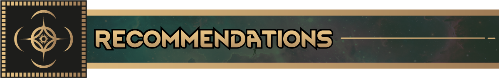
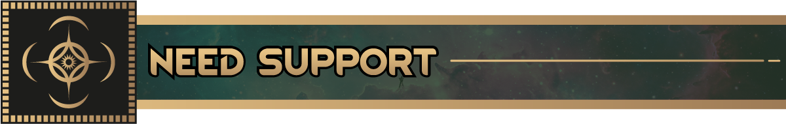
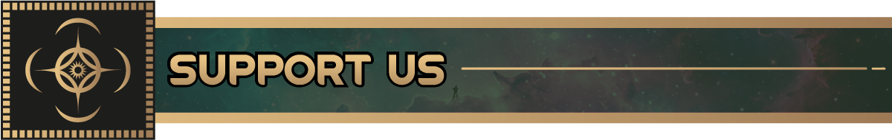
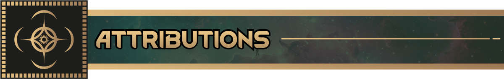

Here are a couple recommended mods that work really well with the Cosmere mods:

* [Nice Bill Tab](https://steamcommunity.com/sharedfiles/filedetails/?id=3520130671)
    * Rusts! This is one of the most gorgeous UI mods this game has. Drastically improves the Bills UI
* [Nice Health Tab](https://steamcommunity.com/sharedfiles/filedetails/?id=3328729902)
    * Storms! This is another awesome mod by Andromeda that makes the Health tab gorgeous

​

Have a bug or suggestion? Leave a comment or suggestion in either location below — your feedback helps improve the
experience for everyone in the
Cosmere.

- [GitHub Source](https://github.com/RimworldCosmere/RimworldCosmere)
- [Discord Community](https://discord.gg/jTcrKfXdYU)

​

Follow along with our development at: https://rimworldcosmere.com

Contribute and donate so we can get more art and other commissions:

* Recurring Donations: https://rimworldcosmere.com/#/portal/
* One Time Donations: https://rimworldcosmere.com/#/portal/support

​

* Big thanks to Sir Van (`sir_vann` On Discord) for in-game art
* Another big thanks to Immortalus (`_immortalus` on Discord) for the Mod Previews and a bunch more art
* Thanks to everyone in the main RimWorld discord #mod-development channel (Especially `aelanna`) for helping with
  random questions

**_This is unofficial fan content, created and shared for non-commercial use. It has not been reviewed by Dragonsteel
Entertainment, LLC or Ludeon Studios._**