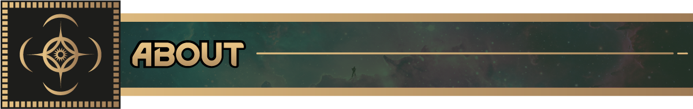
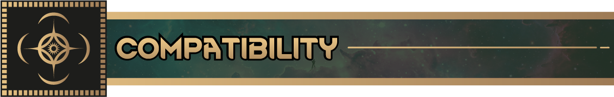
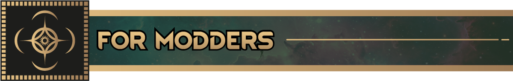

### Part of the RimWorld: Cosmere Project

 

***Spoilers ahead. I have marked what I could, but some will get through. The GitHub issues and the Discord are
not marked at all, so tread carefully there.***

​

*The shared framework every other Cosmere mod is built on.*

​

Cosmere Core carries the Investiture plumbing the rest of the Cosmere mods sit on. On its own it gives you the
framework, not the magic. Allomancy, Surgebinding, and the rest arrive with their own Shardworld mods.

Included features:

- **New StatDefs**
    - `MentalBreakAddFactor`: Changes how likely a pawn is to suffer a mental break
    - `MentalBreakRemoveFactor`: Changes how likely a pawn is to be calmed out of one
    - `Cosmere_Time_Dilation_Factor`: Used mostly by Scadrial's Bendalloy and Cadmium burners, for tuning things
      that have no stat of their own (metal burn rate, for one)
    - `Cosmere_Investiture`: How much Investiture a pawn holds

- **Investiture Need**  
  A pawn need that powers Invested abilities across every Shardworld

- **Investiture Research Project**  
  Opens up Investiture-related gameplay

- **Invested Trait**  
  Innate Investiture, modeled on the Heightenings from Nalthis

- **Shard Selection System**  
  A game component for picking which Shards exist in your world  
  (Scadrial, Roshar, and Nalthis each switch themselves on based on the scenario you pick)

​

- Every other Cosmere expansion requires this mod
- Safe to add at game start
- Requires Biotech. The gene and xenotype systems run through everything here, so there is no pulling them apart
- Built for RimWorld 1.6, and works alongside Biotech, Ideology, Royalty, and Anomaly

​

Core owns the shared traits, needs, and stats so every Shardworld reads the same.  
Register a new Shard through the game component and hook into the Investiture system.

​

​

Mods that pair well with the Cosmere mods:

* [Nice Bill Tab](https://steamcommunity.com/sharedfiles/filedetails/?id=3520130671)
    * Rusts! One of the best looking UI mods this game has. Makes the Bills UI far easier to work with
* [Nice Health Tab](https://steamcommunity.com/sharedfiles/filedetails/?id=3328729902)
    * Storms! Another one from Andromeda. Does the same for the Health tab
* [Gotta Go Fast](https://steamcommunity.com/sharedfiles/filedetails/?id=3712112476)
    * Speeds up pathfinding for pawns that move faster than normal, or that fly
* [BetterWeight](https://steamcommunity.com/sharedfiles/filedetails/?id=2221387317)
    * Gives buildings real weights based on what they are built from. Steel Pushing and Iron Pulling on Scadrial
      feel right with it installed. Heavy steel walls resist a Coinshot's Push. Light wooden furniture goes flying

​

Bugs and suggestions go in either place below. We read both.

- [GitHub Source](https://github.com/RimworldCosmere/RimworldCosmere)
- [Discord Community](https://discord.gg/jTcrKfXdYU)

​

Follow development at https://rimworldcosmere.com

Donations go toward art and other commissions:

* Recurring: https://rimworldcosmere.com/#/portal/
* One time: https://rimworldcosmere.com/#/portal/support

​

Thank you to:

* Sir Van ('sir_vann' on Discord) for in-game art
* Immortalus ('_immortalus' on Discord) for the mod previews and a lot more art
* Everyone in the RimWorld Discord #mod-development channel, 'aelanna' especially, for fielding a pile of odd
  questions

***This is unofficial fan content, created and shared for non-commercial use. It has not been reviewed by Dragonsteel
Entertainment, LLC or Ludeon Studios.***