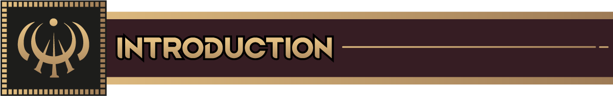
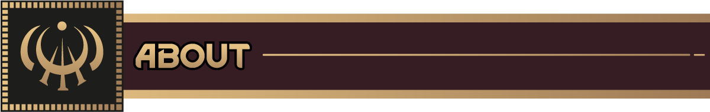
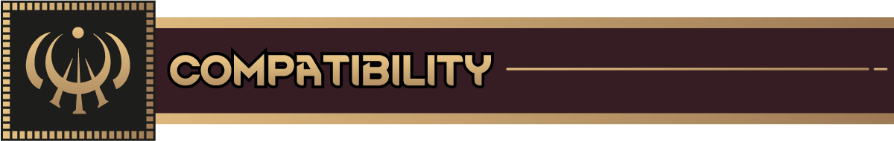
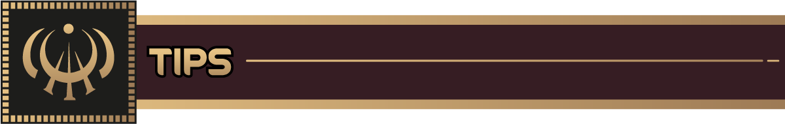
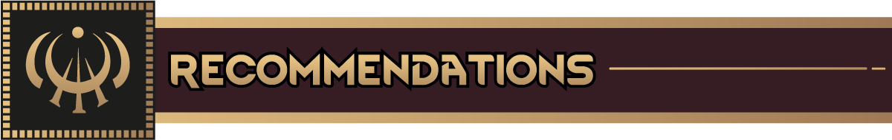
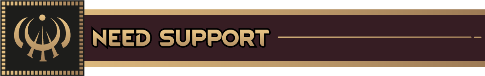
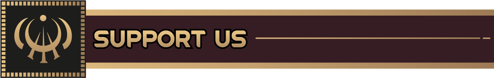
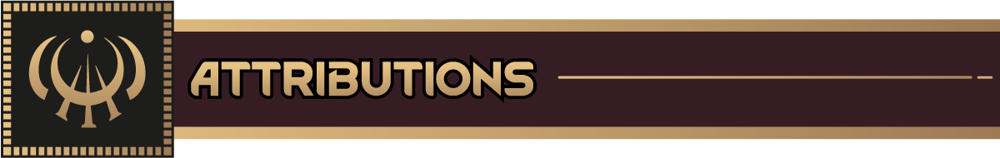



### Part of the RimWorld: Cosmere Project

 

***Spoilers abound. Be careful reading below. I've tried to mark things as spoilers, but I may miss things.***
***Also be weary traversing the issues, or reading through Discord***

​

***This is very much a beta, please be patient. File bug reports in GitHub or Discord***

*Adds the Metallic Arts — Allomancy, Feruchemy, and >!Hemalurgy!< — to RimWorld.*

​

- **Allomancy**
    - Includes every base metal and >!Godmetal!<, each granting unique powers
    - Mistings can burn a single metal — >!Coinshots, Soothers, Thugs, etc.!<
    - Mistborn can burn all metals (if you're lucky enough to have one…)
    - Full burn and flare systems with unique abilities, auras, and status effects
    - Multi-metal vials, targeted abilities, and environmental effects

- **Feruchemy**
    - Store and tap traits like strength, speed, health, or senses
    - Full Feruchemists can master the entire suite of metalminds
    - Custom storage mechanics and UI integration for charge tracking
    - >!Pawns with both Allomantic and Feruchemical powers in one metal can Compound!!<

- **>!Hemalurgy - Coming Soon!<**
    - >!Dark, dangerous, and very real. Use at your own moral peril. WIP but coming soon.!<

- **Genetics-Based Metalborn**
    - Allomantic and Feruchemical powers are inheritable via genes
    - Supports player reproduction, pawn generation, and custom xenotypes

- **Snapping**
    - Pawns can 'snap' under stress, unlocking latent Metalborn potential
    - Includes chance-based snaps during trauma or atmospheric events

- **New Traits, Thoughts, and Needs**
    - Investiture is gained by burning metals
    - Custom thoughts for burning, flaring, auras, and suppression
    - Reworked Skaa, Noble, and Terris xenotypes (based on heritage and genetics)

- **Scenario Support**
    - Pre- and Post-Catacendre scenarios
    - Choose whether Ruin & Preservation or Harmony govern your world
    - Xenotype restrictions, gene weighting, and thematic pawn randomization

​

- Requires Biotech
- Compatible with Ideology, Royalty, and Anomaly
- Designed for RimWorld 1.6
- Safe to add at game start
- Mid-save support is partial — best used in a new colony (you wont get all the metals)

​

- Mistborn and Full Feruchemists are **extremely rare** by default
- >!Use your Lerasium and Atium wisely. There are alloys...!<
- >!Burning Lerasium or Leratium can change everything...!<

​

Here are a couple recommended mods that work really well with the Cosmere mods:

* [Nice Bill Tab](https://steamcommunity.com/sharedfiles/filedetails/?id=3520130671)
    * Rusts! This is one of the most gorgeous UI mods this game has. Drastically improves the Bills UI
* [Nice Health Tab](https://steamcommunity.com/sharedfiles/filedetails/?id=3328729902)
    * Storms! This is another awesome mod by Andromeda that makes the Health tab gorgeous

​

Have a bug or suggestion? Leave a comment or suggestion in either location below — your feedback helps improve the
experience for everyone in the
Cosmere.

- [GitHub Source](https://github.com/RimworldCosmere/RimworldCosmere)
- [Discord Community](https://discord.gg/jTcrKfXdYU)

​

Follow along with our development at: https://rimworldcosmere.com

Contribute and donate so we can get more art and other commissions: 

* Recurring Donations: https://rimworldcosmere.com/#/portal/
* One Time Donations: https://rimworldcosmere.com/#/portal/support

​

* Big thanks to Sir Van (`sir_vann` On Discord) for in-game art
* Another big thanks to Immortalus (`_immortalus` on Discord) for the Mod Previews and a bunch more art
* Thanks to everyone in the main RimWorld discord #mod-development channel (Especially `aelanna`) for helping with
  random questions

**_This is unofficial fan content, created and shared for non-commercial use. It has not been reviewed by Dragonsteel
Entertainment, LLC or Ludeon Studios._**